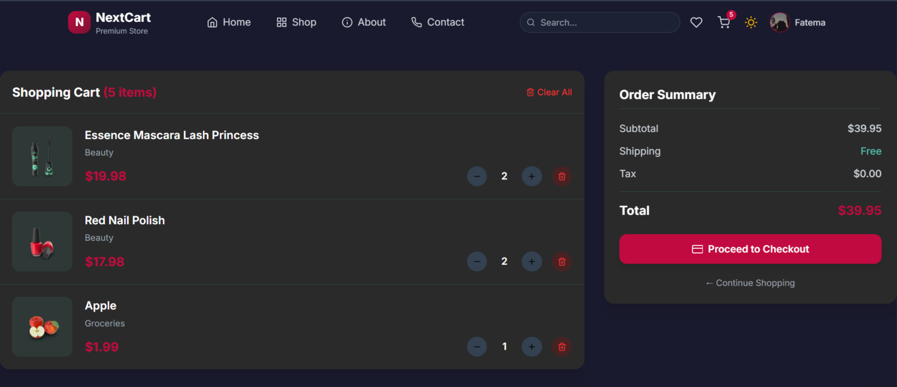
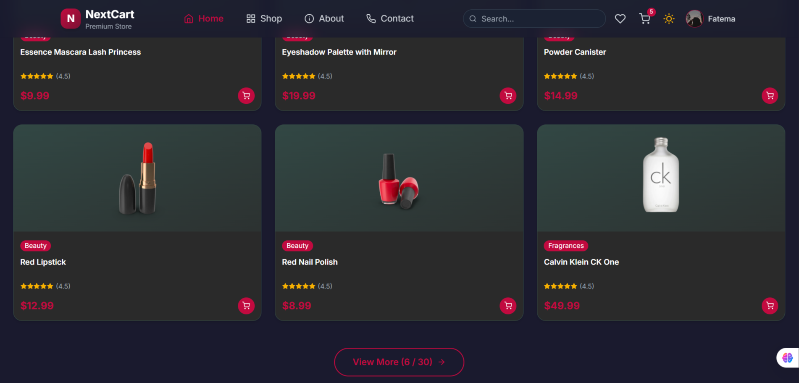
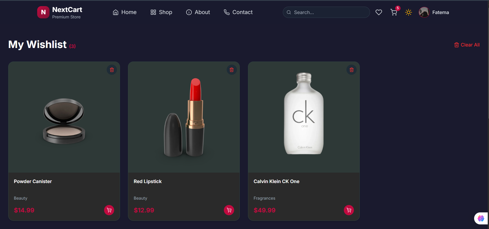
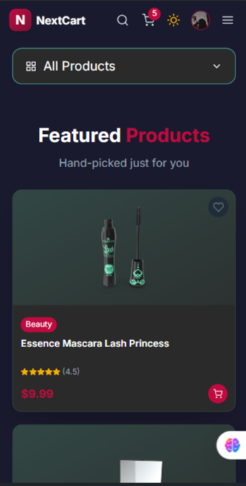
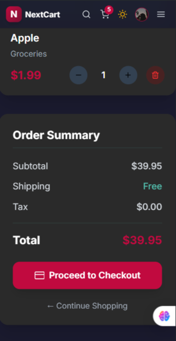

# 🛍 NextCart | Modern Product Store

> A professional e-commerce web application built with React, featuring advanced state management patterns, responsive design, and seamless user experience.

[](https://reactjs.org/)
[](https://redux-toolkit.js.org/)
[](https://tanstack.com/query)
[](https://tailwindcss.com/)
[](https://vitejs.dev/)

---

## 📖 Table of Contents

- [✨ Features](#-features)
- [🛠 Tech Stack](#-tech-stack)
- [📸 Screenshots](#-screenshots)
- [🎬 Demo Video](#-demo-video)
- [🚀 Getting Started](#-getting-started)
- [📁 Project Structure](#-project-structure)
- [👩‍💻 Author](#-author)

---

## ✨ Features

### Core Features
| Feature | Description |
|---------|-------------|
| 🛒 Shopping Cart | Full cart management with Redux Toolkit (add, remove, quantity, clear) |
| 🌙 Dark/Light Mode | Theme switching with Context API + useReducer |
| 📦 Product Management | Product fetching and caching with React Query |
| 🔍 Search & Filter | Real-time product search and category filtering |
| 💖 Wishlist | Save favorite products with localStorage |
| 📱 Fully Responsive | Works perfectly on all devices |

### Bonus Features
- ✅ Cart & theme persistence in localStorage
- ✅ Skeleton loading for better UX
- ✅ Toast notifications with Sonner
- ✅ Pagination (Load More / View More)
- ✅ Sort by price (Low to High / High to Low)
- ✅ Authentication (Login/Register simulation)
- ✅ User profile with avatar upload
- ✅ Product rating by users

---

## 🛠 Tech Stack

| Category | Technologies |
|----------|--------------|
| Frontend | React 19, Vite |
| State Management | Redux Toolkit, Context API + useReducer |
| Data Fetching | React Query + Axios |
| Routing | React Router v7 |
| Styling | Tailwind CSS 3 |
| Icons | React Icons |
| Notifications | Sonner |
| API | DummyJSON API |

---

## 📸 Screenshots

### Desktop View

| Slice Page | Shop Page |
|-----------|-----------|
|  |  |

|Wishlist Page |
|-----------|---------------|
|  |

### Mobile View

| Mobile Home | Mobile Menu |
|-------------|-------------|
|  |  |
---

## 🎬 Demo Video

[](https://youtu.be/8SYSv9yTUIs)

> Click the badge above to watch the complete demo video.

---

## 🚀 Getting Started

### Prerequisites

- Node.js (v18 or higher)
- npm or yarn

### Installation

# Clone the repository
git clone https://github.com/FatemaAhm4di/nextcart.git

# Navigate to project directory
cd nextcart

# Install dependencies
npm install

# Start development server
npm run dev

# Build for production
npm run build
nextcart/
```

├── public/

│   ├── favicon.png

│   ├── images/

│   └── screenshots/

├── src/

│   ├── app/   

│   ├── assets/

│   ├── components/

│   │   ├── layout/

│   │   ├── product/

│   │   ├── settings/

│   │   └── ui/ 

│   ├── context/

│   ├── features/ 

│   ├── hooks/

│   ├── pages/

│   ├── routes/ 

│   ├── services/ 

│   └── utils/ 

├── index.html

├── package.json

├── tailwind.config.js

└── README.md

👩‍💻 Author:
Fatema Ahmadi

GitHub: @FatemaAhm4di

Instagram: @fatem4

Telegram: @Fatemah_Ahmadi

⭐️ Show your support
If you found this project helpful, please give it a ⭐️ on GitHub!
